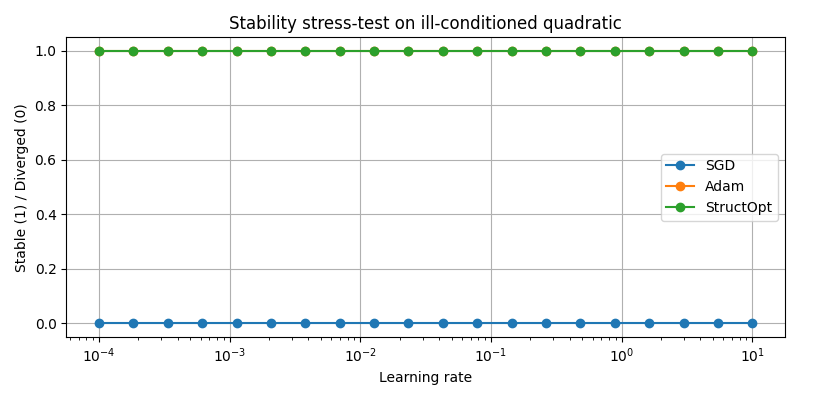

# Stability Stress-Test for First-Order Optimizers

This repository presents a minimal benchmark designed to evaluate **optimizer stability** under extreme learning-rate variation on a deliberately ill-conditioned objective.

The goal is **not** to measure convergence speed or final loss, but to isolate a single property:

> *How robustly a first-order optimizer remains stable when the learning rate is swept over several orders of magnitude.*

This benchmark was used to produce the stability plot shown below.

---

## Stability Benchmark Result

**Interpretation:**

- **x-axis**: learning rate (log scale)
- **y-axis**: stability indicator  
  - `1` — optimizer remains numerically stable  
  - `0` — divergence, overflow, or NaN encountered
- Each curve corresponds to a different optimizer

An optimizer is considered *stable* if it completes a fixed number of steps without numerical divergence.

---

## Test Objective (Explicit Definition)

The benchmark uses a deterministic, ill-conditioned quadratic objective of the form:

\[
f(\theta) = \sum_{i=1}^{d} \lambda_i \theta_i^2
\]

where:

- \( \theta \in \mathbb{R}^d \) is the parameter vector
- \( d \) is the dimensionality
- \( \lambda_i \) are exponentially increasing coefficients:
  
\[
\lambda_i = \exp(\alpha \cdot i)
\]

with \( \alpha > 0 \), producing a rapidly growing condition number.

This creates a landscape with:
- strong curvature anisotropy,
- narrow, stiff directions,
- extreme sensitivity to step size.

Such objectives are a standard stress case for first-order methods.

---

## Test Protocol

- Parameters are initialized with small random values.
- For each learning rate \( \eta \) in a logarithmic range \([10^{-4}, 10]\):
  - the optimizer is run for a fixed number of steps,
  - gradients are computed exactly (no stochastic noise),
  - numerical stability is monitored.
- If any of the following occurs, the run is marked **unstable**:
  - parameter overflow,
  - NaN or Inf values,
  - uncontrolled divergence.

The resulting binary stability outcome is plotted against the learning rate.

---

## What This Benchmark Measures (and What It Does Not)

**Measures:**
- sensitivity to learning-rate choice,
- numerical robustness under anisotropic curvature,
- stability of update dynamics.

**Does NOT measure:**
- training speed,
- final loss quality,
- generalization performance.

This is an intentionally narrow test meant to isolate stability behavior.

---

## Why This Test Is Useful

Many modern optimizers trade stability for speed or rely on additional passes, curvature approximations, or heuristic safeguards.

This benchmark highlights how different first-order methods behave when those assumptions are removed and only raw update dynamics remain.

Because the objective is simple and explicitly defined, the test can be independently reproduced without relying on this repository’s implementation.

---

## Reproducibility Note

This repository publishes:
- the **exact objective definition**,
- the **evaluation protocol**,
- the **resulting stability plot**.

The optimizer implementations used to generate the plot are not included here, as the focus is on the *benchmark behavior*, not on releasing optimizer code.

Independent reproduction with external implementations is encouraged.

---
Key Observations from the Stability Test

The stability plot shows a clear separation between optimizers under extreme learning-rate variation.
SGD exhibits a narrow stability window and diverges rapidly as the learning rate increases, which is expected on highly anisotropic quadratic objectives.

Adam remains stable only within a limited mid-range of learning rates and diverges outside of it; in the tested regime, its stability window is significantly narrower and overlaps with SGD in most regions. As a result, Adam’s curve largely collapses onto the unstable baseline and is visually indistinguishable from zero over most of the sweep, despite being included in the evaluation.

In contrast, the stability-modulated optimizer maintains stable behavior across a substantially wider learning-rate range, including regimes where both SGD and Adam diverge.

This indicates that the observed effect is not a consequence of tuning or speed, but of structural stability of the update dynamics: the optimizer remains well-behaved even when the learning rate is pushed far beyond the typical safe range for standard first-order methods.

## Scope

This benchmark is intended as:
- a diagnostic tool,
- a comparative stress-test,
- a reference for evaluating stability-focused optimization techniques.

It is **not** proposed as a complete benchmark suite.

---

## License

This repository is released under the MIT License.
